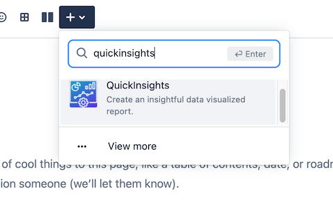

1. [Welcome to QuickInsights for Confluence Cloud](#intro)
2. [Macros Usages](#macrousage)
    1. [Area Charts](#areachart)
    2. [Bar Charts](#barchart)
    3. [Line Charts](#linechart)
    4. [Pie Charts](#piechart)
3. [Support](#support)
    1. [Contact us](#contactus)
4. [FAQ](#faq)
    1. 

## Welcome to QuickInsights for Confluence Cloud  ##
QuickInsights for Confluence cloud is a useful tool that provide a simple and easy way to create a data visualized chart for your page. QuickInsights chart can be created to give a clear insight into patterns, trends and great representations of a given data sets. 

## Macros Usages  ##
### Area Charts  ###
Area chart allows user to create a graph that combines a line chart and a bar chart to show changes in quantities over time. 
####How to configure Area Charts 
1. Navigate to the page and enter Edit mode.

2. Once you are in the page edit mode, locate the dropdown menu with `+` icon. Enter the macro name: `QuickInsights` and select the macro.

