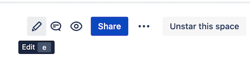
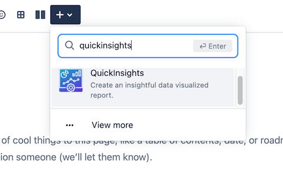
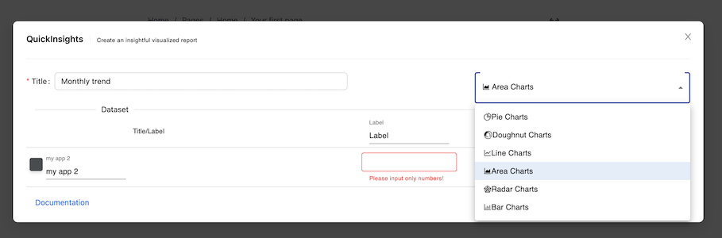
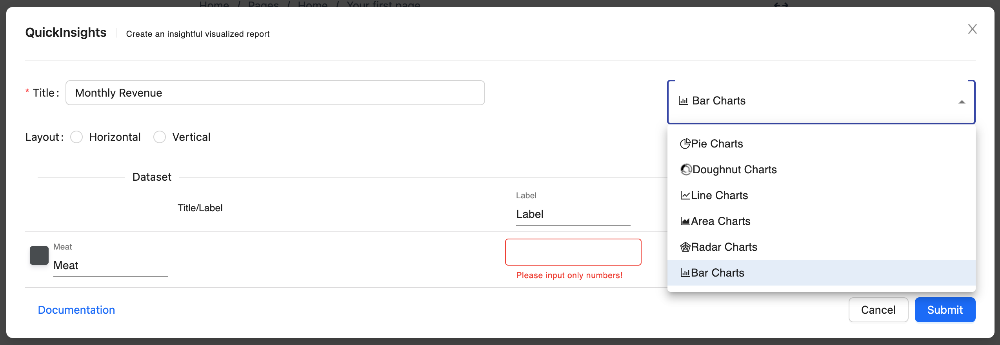
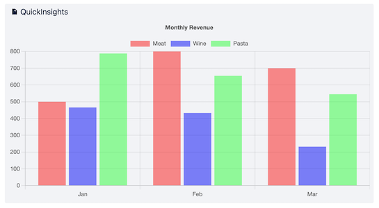

1. [Welcome to QuickInsights for Confluence Cloud](#intro)
2. [Macros Usages](#macrousage)
    1. [Area Charts](#areachart)
    2. [Bar Charts](#barchart)
    3. [Line Charts](#linechart)
    4. [Pie Charts](#piechart)
3. [Support](#support)
    1. [Contact us](#contactus)
4. [FAQ](#faq)
    1. 

## Welcome to QuickInsights for Confluence Cloud  ##
QuickInsights for Confluence cloud is a useful tool that provide a simple and easy way to create a data visualized chart for your page. QuickInsights chart can be created to give a clear insight into patterns, trends and great representations of a given data sets. 

## Macros Usages  ##
### Area Charts  ###
Area chart allows user to create a graph that combines a line chart and a bar chart to show changes in quantities over time. 
####How to configure Area Charts 
1. Navigate to the page and enter Edit mode.

2. Once you are in the page edit mode, locate the dropdown menu with `+` icon. Enter the macro name: `QuickInsights` and select the macro.

3. A macro editor will popup, select Area Charts from the dropdown menu.

4. You can start configuring the chart by entering Title, Dataset Title, Label, and Color.

| Properties      | Default value | Descriptions  |
| :---            |    :----:     |     :----:    |
| Title           | `none`        | The title of your chart, it will be displayed as a legend text at the top   |
| Charts          | `Pie Chart`    | The chart dropdown menu selection     |
| Dataset Title   | `none`        | The title of your dataset, you can pick a color from the color picker placed at the left of the title input field.     |
| Label           | `none`        | Your description of the label, it will display as a tooltip when you hover to the datasets. The subsequence row of Label will be the value of the current label, it only accept `numbers`|

5. Click `Submit` button when you are done configuring it, and here you go!

### Bar Charts  ###
Bar chart allows user to create a graph visualization that summarizing a set of categorical data.
####How to configure Bar Charts 
1. Navigate to the page and enter Edit mode.

2. Once you are in the page edit mode, locate the dropdown menu with `+` icon. Enter the macro name: `QuickInsights` and select the macro.

3. A macro editor will popup, select Bar Charts from the dropdown menu.

4. You can start configuring the chart by entering Title, Dataset Title, Label, and Color.

| Properties      | Default value | Descriptions  |
| :---            |    :----:     |     :----:    |
| Title           | `none`        | The title of your chart, it will be displayed as a legend text at the top   |
| Charts          | `Pie Chart`    | The chart dropdown menu selection     |
| Layout          | `Vertical`    | The layout of your chart, either horizontal or vertical     |
| Dataset Title   | `none`        | The title of your dataset, you can pick a color from the color picker placed at the left of the title input field.     |
| Label           | `none`        | Your description of the label, it will display as a tooltip when you hover to the datasets. The subsequence row of Label will be the value of the current label, it only accept `numbers`|

5. Click `Submit` button when you are done configuring it, and here you go!

