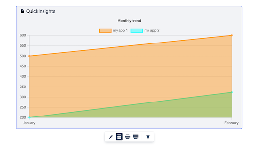
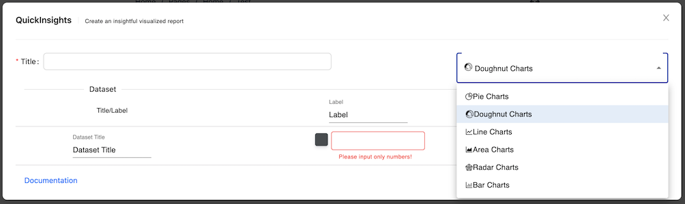

1. [Welcome to QuickInsights for Confluence Cloud](#intro)
2. [Macros Usages](#macrousage)
    1. [Area Chart](#areachart)
    2. [Bar Chart](#barchart)
    3. [Doughnut Chart](#doughnutchart)   
    4. [Line Chart](#linechart)
    5. [Pie Chart](#piechart)
    6. [Radar Chart](#radarchart)
3. [Support](#support)
    1. [Contact us](#contactus)
4. [FAQ](#faq)
    1. 

## Welcome to QuickInsights for Confluence Cloud  ##
QuickInsights for Confluence cloud is a useful tool that provide a simple and easy way to create a data visualized chart for your page. QuickInsights chart can be created to give a clear insight into patterns, trends and great representations of a given data sets. 

## Macros Usages  ##
### Area Chart  ###
Area chart allows user to create a graph that combines a line chart and a bar chart to show changes in quantities over time. 
####How to configure Area Charts 
i. Navigate to the page and enter Edit mode.

ii. Once you are in the page edit mode, locate the dropdown menu with `+` icon. Enter the macro name: `QuickInsights` and select the macro.

iii. A macro editor will popup, select Area Charts from the dropdown menu.

iv. You can start configuring the chart by entering Title, Dataset Title, Label, and Color.

| Properties      | Default value | Descriptions  |
| :---            |    :----:     |     :----:    |
| Title           | `none`        | The title of your chart, it will be displayed as a legend text at the top   |
| Charts          | `Pie Chart`    | The chart dropdown menu selection     |
| Dataset Title   | `none`        | The title of your dataset, you can pick a color from the color picker placed at the left of the title input field.     |
| Label           | `none`        | Your description of the label, it will display as a tooltip when you hover to the datasets. The subsequence row of Label will be the value of the current label, it only accept `numbers`|

v. Click `Submit` button when you are done configuring it, and here you go!

### Bar Chart  ###
Bar chart allows user to create a graph visualization that summarizing a set of categorical data.
####How to configure Bar Charts 
i. Navigate to the page and enter Edit mode.

ii. Once you are in the page edit mode, locate the dropdown menu with `+` icon. Enter the macro name: `QuickInsights` and select the macro.

iii. A macro editor will popup, select Bar Charts from the dropdown menu.

iv. You can start configuring the chart by entering Title, Dataset Title, Label, and Color.

| Properties      | Default value | Descriptions  |
| :---            |    :----:     |     :----:    |
| Title           | `none`        | The title of your chart, it will be displayed as a legend text at the top   |
| Charts          | `Pie Chart`    | The chart dropdown menu selection     |
| Layout          | `Vertical`    | The layout of your chart, either horizontal or vertical     |
| Dataset Title   | `none`        | The title of your dataset, you can pick a color from the color picker placed at the left of the title input field.     |
| Label           | `none`        | Your description of the label, it will display as a tooltip when you hover to the datasets. The subsequence row of Label will be the value of the current label, it only accept `numbers`|

v. Click `Submit` button when you are done configuring it, and here you go!

### Doughnut Chart  ###
Doughnut chart allows user to create a pie chart with a center cut out to look like a donut.
####How to configure Doughnut Chart 
i. Navigate to the page and enter Edit mode.

ii. Once you are in the page edit mode, locate the dropdown menu with `+` icon. Enter the macro name: `QuickInsights` and select the macro.

iii. A macro editor will popup, select Doughnut Chart from the dropdown menu.

iv. You can start configuring the chart by entering Title, Dataset Title, Label, and Color.

| Properties      | Default value | Descriptions  |
| :---            |    :----:     |     :----:    |
| Title           | `none`        | The title of your chart, it will be displayed as a legend text at the top   |
| Charts          | `Pie Chart`    | The chart dropdown menu selection     |
| Dataset Title   | `none`        | The title of your dataset.  |
| Label           | `none`        | Your description of the label, it will display as a tooltip when you hover to the datasets. The subsequence row of Label will be the value of the current label, it only accept `numbers`. For Doughnut chart, you can pick a color from the color picker placed at the left of the title input field.   |

v. Click `Submit` button when you are done configuring it, and here you go!

### Line Chart  ###
Line chart allows user to create a graph visualization used to show information that changes over time.
####How to configure Line Charts 
i. Navigate to the page and enter Edit mode.

ii. Once you are in the page edit mode, locate the dropdown menu with `+` icon. Enter the macro name: `QuickInsights` and select the macro.

iii. A macro editor will popup, select Line Charts from the dropdown menu.

iv. You can start configuring the chart by entering Title, Dataset Title, Label, and Color.

| Properties      | Default value | Descriptions  |
| :---            |    :----:     |     :----:    |
| Title           | `none`        | The title of your chart, it will be displayed as a legend text at the top   |
| Charts          | `Pie Chart`    | The chart dropdown menu selection     |
| Dataset Title   | `none`        | The title of your dataset, you can pick a color from the color picker placed at the left of the title input field.     |
| Label           | `none`        | Your description of the label, it will display as a tooltip when you hover to the datasets. The subsequence row of Label will be the value of the current label, it only accept `numbers`|

v. Click `Submit` button when you are done configuring it, and here you go!

### Pie Chart  ###
Pie chart allows user to create a visualized graph that displays data in a circular graph.
####How to configure Pie Charts 
i. Navigate to the page and enter Edit mode.

ii. Once you are in the page edit mode, locate the dropdown menu with `+` icon. Enter the macro name: `QuickInsights` and select the macro.

iii. A macro editor will popup, Pie Charts will be the default value, if you are changing from other selection, just change back to Pie Charts from the dropdown menu.

iv. You can start configuring the chart by entering Title, Dataset Title, Label, and Color.

| Properties      | Default value | Descriptions  |
| :---            |    :----:     |     :----:    |
| Title           | `none`        | The title of your chart, it will be displayed as a legend text at the top   |
| Charts          | `Pie Chart`    | The chart dropdown menu selection     |
| Dataset Title   | `none`        | The title of your dataset.  |
| Label           | `none`        | Your description of the label, it will display as a tooltip when you hover to the datasets. The subsequence row of Label will be the value of the current label, it only accept `numbers`. For Pie charts, you can pick a color from the color picker placed at the left of the title input field.   |

v. Click `Submit` button when you are done configuring it, and here you go!

### Radar Chart  ###
Radar chart allows user to create a visualized graph that displays multivariate data of three or more quantitative variables mapped onto an axis.
####How to configure Radar Charts 
i. Navigate to the page and enter Edit mode.

ii. Once you are in the page edit mode, locate the dropdown menu with `+` icon. Enter the macro name: `QuickInsights` and select the macro.

iii. A macro editor will popup, select Radar Chart from the dropdown menu.

iv. You can start configuring the chart by entering Title, Dataset Title, Label, and Color.

| Properties      | Default value | Descriptions  |
| :---            |    :----:     |     :----:    |
| Title           | `none`        | The title of your chart, it will be displayed as a legend text at the top   |
| Charts          | `Pie Chart`    | The chart dropdown menu selection     |
| Dataset Title   | `none`        | The title of your dataset, you can pick a color from the color picker placed at the left of the title input field.     |
| Label           | `none`        | Your description of the label, it will display as a tooltip when you hover to the datasets. The subsequence row of Label will be the value of the current label, it only accept `numbers`|

v. Click `Submit` button when you are done configuring it, and here you go!

